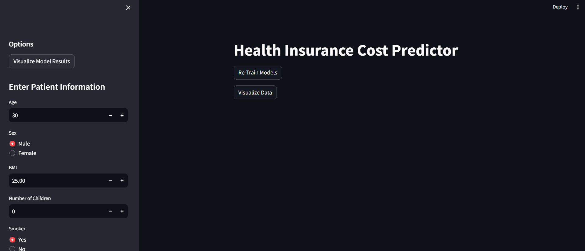
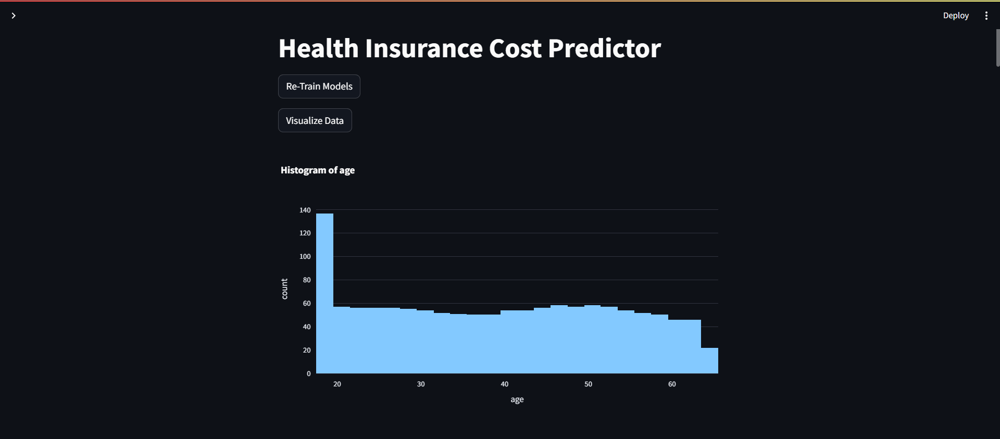
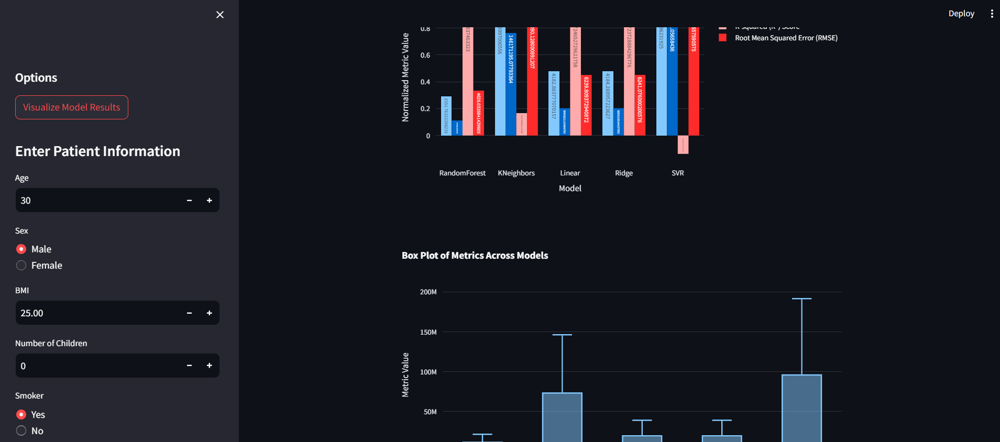
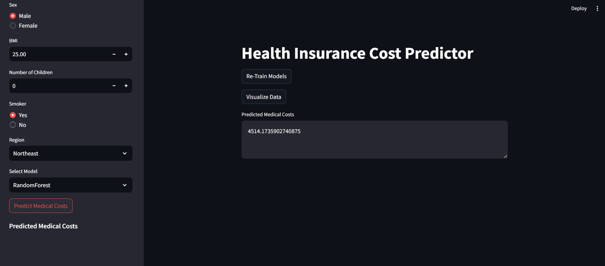
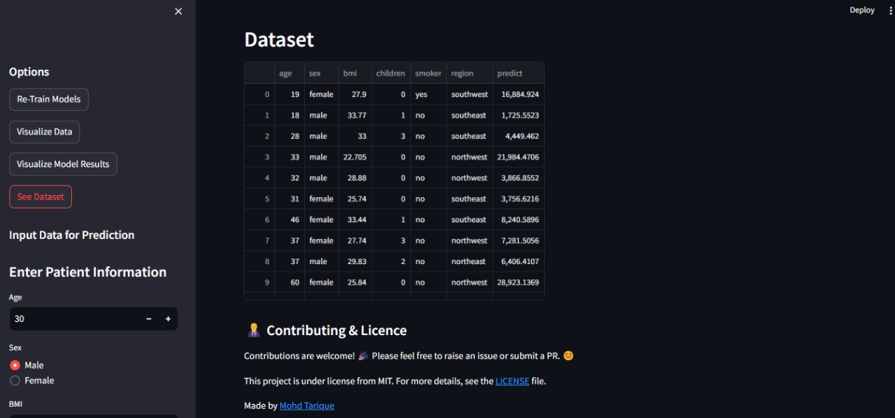

<h1 align="center">Health Insurance Prediction System</h1>

<h4 align="center"> 
	 🚀 Streamlit based Health Insurance Prediction System.
</h4> 

## 🎯 About ##

This system includes modules for predicting individual medical costs billed by health insurance, training and evaluating multiple regression models, preprocessing datasets for training, and visualizing datasets.

### 1. Prediction Module ###

- **Description:** This module loads saved regression models and makes predictions using them.
- **File:** `prediction.py`
- **Usage:**
  ```python
  from prediction import ModelPredictor
  
  # Initialize ModelPredictor
  predictor = ModelPredictor(model_names=["Linear", "RandomForest"], model_path="./models/")
  
  # Load models
  predictor.load_models()
  
  # Predict medical costs
  prediction = predictor.predict(input_data, model)
  ```

### 2. Model Trainer Module ###

- **Description:** This module trains and evaluates multiple regression models, including Random Forest, K-Nearest Neighbors, Linear Regression, Ridge Regression, and Support Vector Regressor.
- **File:** `model_trainer.py`
- **Usage:**
  ```python
  from model import ModelTrainer
  
  # Initialize ModelTrainer
  trainer = ModelTrainer(model_names=["RandomForest", "Linear"], dataset={"dataset_path": "./data/data.csv", "target_column": "predict"})
  
  # Train models
  trainer.train_save_models()
  ```

### 3. Preprocessing Module ###

- **Description:** This module preprocesses datasets for training, including encoding categorical data and handling missing data.
- **File:** `preprocess.py`
- **Usage:**
  ```python
  from preprocess import DatasetPreprocessor
  
  # Initialize DatasetPreprocessor
  preprocessor = DatasetPreprocessor(strategy="mean")
  
  # Preprocess data
  preprocessed_data = preprocessor.preprocess_data(dataset)
  ```

### 4. Data Visualizer Module ###

- **Description:** This module visualizes datasets using histograms, bar charts, and scatter plots.
- **File:** `data_visualizer.py`
- **Usage:**
  ```python
  from visualise import DataVisualizer
  
  # Initialize DataVisualizer
  visualizer = DataVisualizer(dataset_path="./data/data.csv")
  
  # Visualize data
  plots = visualizer.visualize_data()
  ```

## ✅ Requirements ##

Before starting, make sure you have installed:

- [Python](https://www.python.org/)
- [Pandas](https://pandas.pydata.org/)
- [Streamlit](https://streamlit.io/)
- [Plotly](https://plotly.com/python/)
- [Scikit-learn](https://scikit-learn.org/stable/)
- [Joblib](https://joblib.readthedocs.io/en/latest/)

## 📍 Starting ##

1. **Clone the repository:**

   ```bash
   git clone https://github.com/Mohd-Tarique99/Health-Insurance-Prediction.git
   ```

2. **Install Python:**

   Download and install Python from the [official website](https://www.python.org/downloads/). Make sure to select the option to add Python to PATH during installation.

3. **Install dependencies:**

   Navigate to the project directory and install the required dependencies using pip:

   ```bash
   cd health-insurance-prediction
   pip install -r requirements.txt
   ```

4. **Run the Streamlit application:**

   Once the dependencies are installed, you can run the Streamlit application using the following command:

   ```bash
   streamlit run app.py
   ```

   This will start the Streamlit server, and you can access the interface by opening the provided URL in your web browser.

## 📊 Dataset Description ##

The dataset used in this project contains the following columns:

1. **age**: Age of the primary beneficiary.
2. **sex**: Gender of the insurance contractor, either female or male.
3. **bmi**: Body mass index, an objective index of body weight (kg/m^2) calculated using the ratio of height to weight.
   - *Note*: Ideally, a BMI of 18.5 to 24.9 is considered normal.
4. **children**: Number of children covered by health insurance or number of dependents.
5. **smoker**: Indicates whether the individual is a smoker (yes) or non-smoker (no).
6. **region**: The beneficiary's residential area in the US, categorized into northeast, southeast, southwest, or northwest.
7. **charges**: Individual medical costs billed by health insurance.

This dataset provides information about individuals' demographic attributes, lifestyle choices (such as smoking), and medical charges billed by health insurance. It is used for training regression models to predict individual medical costs based on these features.

You can access the dataset [here](https://www.kaggle.com/datasets/mirichoi0218/insurance).

## 📷 Screenshots ##

<div align="center" id="top"> 
  
  &#xa0;

</div>

<div align="center" id="top"> 
  
  &#xa0;

</div>

<div align="center" id="top"> 
  
  &#xa0;

</div>

<div align="center" id="top"> 
  
  &#xa0;

</div>

<div align="center" id="top"> 
  
  &#xa0;

</div>

## 👨‍💼 Contributing ##

For major changes, please open an issue first to discuss what you would like to change.

## 📝 License ##

This project is under license from MIT. For more details, see the [[LICENSE](https://github.com/Mohd-Tarique99/Health-Insurance-Prediction/blob/main/LICENSE.txt)](LICENSE) file.

Made by <a href="https://github.com/Mohd-Tarique99" target="_blank">Mohd Tarique</a>

&#xa0;

<a href="#top">Back to top</a>
